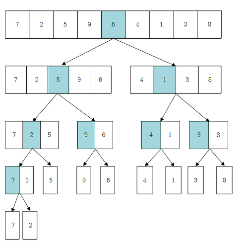
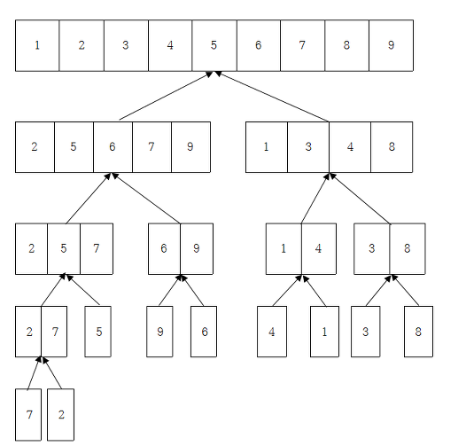
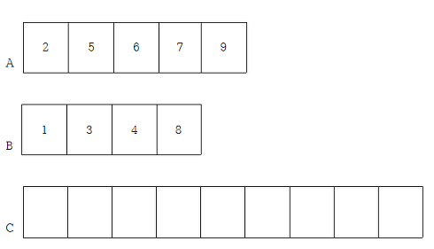
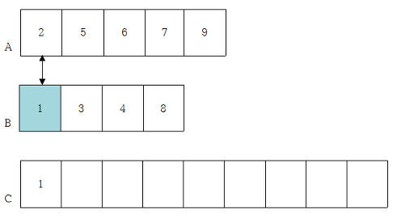
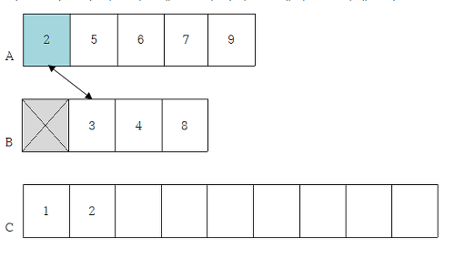
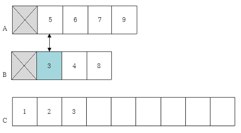
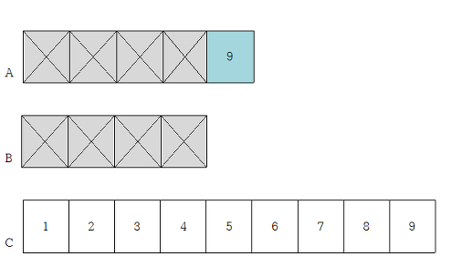

# [분할 정복(Divide and Conquer)](https://ko.khanacademy.org/computing/computer-science/algorithms/merge-sort/a/divide-and-conquer-algorithms)

엄청나게 크고 방대한 문제를 조금씩 조금씩 나눠가면서 용이하게 풀 수 있는 문제 단위로 나눈 다음 그것들을 다시 합쳐서 해결하자는 개념에서 출발한 방법이다. ~~개인적으로 Base case에 도달해서 문제를 푸는 방식이 수학적 귀납법(mathematical induction)이랑 비슷하다고 생각한다.~~ 

## 방법

분할 정복 방식이 하위 문제를 **재귀적**으로 해결하기 때문에 하위 문제 각각은 원래 문제보다 범위가 작아야 하며 하위 문제는 각 문제마다 **탈출 조건**이 존재해야 한다. 보통 아래와 같은 절차로 문제를 푼다.

1.  **분할**: 원래 문제를 분할하여 비슷한 유형의 더 작은 하위 문제들로 나눈다.
2.  **정복**: 문제가 분할이 가능하면 계속 분할하고, 분할할 수 없을 만큼 작으면 탈출조건에 맞게 문제를 푼다.
3.  **합치기**: 하위 문제들의 답을 합쳐서 원래 문제를 해결한다.


>문제가 제대로 나뉘어 있으면 정복(Conquer)은 쉽기 때문에 분할(Divide)이 중요하다.


아래는 위 설명을 수도코드로 옮긴 것이다.
```
function F(x):
  if F(x)가 간단 then:	// Base case
    return F(x)를 계산한 값
  else:
    x 를 x1, x2로 분할
    F(x1)과 F(x2)를 호출
    return F(x1), F(x2)로 F(x)를 구한 값
```


> 위처럼 분할 정복 알고리즘은 보통 **재귀 함수**(recursive function)를 통해 자연스럽게 구현되는데, 함수 호출 오버헤드 때문에 실행 속도가 늦어진다는 단점이 있다.


# 예제(Examples)

피보나치 수를 구하는 문제와 분할 정렬법 문제를 가져왔다. 사용된 언어는 c++이다.


## 1. 피보나치 수(Fibonacci number)

피보나치 수열이란 0과 1을 시작으로 바로 앞 두 항을 더한 값을 연속적으로 구해 나열한 것이다. 즉, 아래 표와 같이 0번째 피보나치 수는 0, 1번째 피보나치 수는 1, 2번째 피보나치수는 0번째와 1번째 피보나치 수를 더한 0+1=1, ...,  **n-th 피보나치 수는 (n-1)th와 (n-2)th 피보나치 수의 합**이 된다.

n-th|0|1|2|3|4|5|6|7|8|9|10|...
-|-|-|-|-|-|-|-|-|-|-|-|-
Fib|0|1|1|2|3|5|8|13|21|34|55|...


> Fib(n)=Fib(n-2)+Fib(n-1), where Fib(0)=0, Fib(1)=1


10번째 피보나치 수를 구한다고 생각해보자. 우린 처음부터 10번째 피보나치 수를 구할 수 없다. 앞에서 생각한 것처럼 더 작은 수부터 떠올려야한다. ~~(이것이 바로 분할 정복이다.)~~ 
Fib(10)을 구하기 위해 먼저 Fib(9)와 Fib(8) 을 구하는 것으로 문제를 **분할**하고 두개를 더해 원래 구하려던 Fib(10)을 구하는 것이 **합치기** 단계가 되겠다. **정복**은 어떻게 할까? Base case인 n=0, n=1이 될 때 까지 미친듯이 쪼갠다. ~~(too easy?)~~ 

```c++
int fibo_recur(int n) {
	if (n == 0) return 0;
	else if (n == 1) return 1;
	else return fibo_recur(n - 1) + fibo_recur(n - 2);
}
```


>문제점: 함수 호출이 얼마나 될지 상상해봐라. 그리고 불필요하게 중복되는 호출이 상당히 많이 발생한다.  
>Fib(10) = Fib(9) + Fib(8)  
>Fib(10) = Fib(8) + Fib(7) + Fib(7) + Fib(6)  
>Fib(10) = Fib(7) + Fib(6) + Fib(6) + Fib(5) + Fib(6) + Fib(5) + Fib(5) + Fib(4)  
> ...


## 2. [합병 정렬(Merge Sort)](https://janghw.tistory.com/entry/%EC%95%8C%EA%B3%A0%EB%A6%AC%EC%A6%98-Divide-and-Conquer-%EB%B6%84%ED%95%A0%EC%A0%95%EB%B3%B5)

### 기본 알고리즘

분할정복방식을 이용해 정렬을 하는 합병정렬 방식에 대해 알아보자.

큰 알고리즘은 아래와 같다.
1. 정렬할 데이터 집합의 크기가 0 or 1 이면 정렬이 끝난 것이다. (**탈출**조건)
2. 그렇지 않으면 데이터 집합을 반으로 **분할**한다.
3. 같은 집합에서 쪼개진 데이터 집합을 **병합**한다.  이 때 데이터 원소들을 정렬하며(**정복**) 병합한다.
4. 원래의 하나의 큰 집합이 될때까지 3을 반복한다.

위 설명을 다시 그림으로 살펴보자.  

**분할**: 1부터 9까지 섞여있는 데이터 집합이 있다고 하자. 알고리즘 1~2번 과정에 따라 데이터 집합의 크기가 1이나 0이 될 때까지 계속 나눈다.

  


**정복 & 합병**: 분할은 끝났으니 정복을 해보자. 알고리즘 3~4번 과정을 진행한다.  

  


### 어떻게 정렬하며 합치는가?

우리는 단순히 알고리즘을 이해하는 것에서 벗어나서, 구현도 할 줄 알아야하기 때문에 어떻게 두 집합을 정렬하면서 합칠지도 생각해 봐야한다.

정렬하면서 합치는 알고리즘은 다음과 같다. (오름차순 가정)
1. 두 데이터 집합의 크기의 합만한 빈 데이터 집합C를 만들어 둔다.
2. 두 집합의 첫 번째 요소를 비교해서 더 작은 요소를 집합C의 비어있는 칸 중 제일 왼쪽에 넣어준다. 이렇게 C에 들어간 원소는 원래 집합에서 삭제한다.
3. 두 집합에 원소가 남아있지 않을때까지 2번을 반복한다.

구체적인 예시를 함께 보자. 1번 알고리즘에 맞게 집합 A와 B의 크기에 맞는 빈 집합C를 만든다.  


알고리즘 2번에 따라 집합 A와 B의 첫 원소를 비교한다. B의 첫 원소가 더 작으므로 C에 1을 삽입후 B에서 1을 삭제한다.  


A의 2와 B의 3을 비교한다. A의 2가 작으니 C에 2를 추가하고 A에서 지워준다.  


A의 5와 B의 3을 비교한다. B의 3이 작으니 C에 3을 추가하고 B에서 3을 지워준다.  


계속 하다보면 아래와 같은 상태에 도달하게 된다. 이렇게 우리는 오름차순으로 정렬된 집합C를 얻게 된다. 이 방식을 **합치기**과정에서 계속 진행하는 것이다.  


### 예시 코드
```c++
// 편의상 함수명을 divide 와 conquer로 지었음.

void divide(int a[], int leftmost, int rightmost, int size) {
	if (leftmost < rightmost) { //원소가 두개 이상이면 탈출조건에 도달하기 위해 무조건 쪼개져야한다
		int mid = (leftmost + rightmost) / 2; 

		divide(a, leftmost, mid, size); // 왼쪽에 있는 반절난 어레이가 다시 쪼개지러감
		divide(a, mid + 1, rightmost, size); //오른쪽에 있는 반절난 어레이가 다시 쪼개지러감
		
		// 탈출된 홑원소 어레이를 시작으로 conquer함수가 불리기 시작한다.
		conquer(a, leftmost, mid, rightmost, size); 
	}
	// 이 if문에 걸리지 않으면(= 원소가 하나짜리인 어레이)
	// 아무것도 안하고 호출된 곳으로 return된다. 즉, 탈출!
}

void conquer(int a[], int left, int mid, int right, int size) {
	// 어레이 두개를 관리할 것이며 편의상 i와 j가 우선 두 어레이의 leftmost를 기록한다.
	int i = left, j = mid + 1;
	// 따라서 왼쪽 어레이는 a[i]~a[mid], 오른쪽 어레이는 a[j]~a[right]
	
	int k = left; // k 역시 leftmost 기록
	
	int *temp = new int[size]; // 임시 공간
	
	while (i <= mid & j <= right) { // 첫 원소들을 비교하면서 temp에 넣어준다.
		if (a[i] <= a[j]) {
			temp[k] = a[i];
			i++;
		}
		else {
			temp[k] = a[j];
			j++;
		}
		k++;
	}

	if (i > mid) { // 정확하게 반띵된게 아니라서 오른쪽 어레이에 더 남아있을 수 있음. 전부 temp에 옮겨줌
		for (int p = j; p <= right; p++) {
			temp[k] = a[p];
			k++;
		}
	}
	else { // 왼쪽 어레이에 원소가 남아있는 경우이다.
		for (int p = i; p <= mid; p++) {
			temp[k] = a[p];
			k++;
		}
	}

	for (int q = left; q <= right; q++) { //원래 배열에 옮겨줘~
		a[q] = temp[q];
	}
	
	delete[] temp;

}

```
