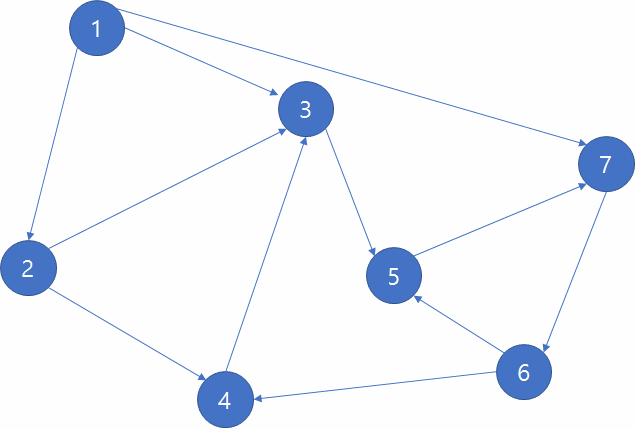

# [Graph Data Structure And Algorithms](https://www.geeksforgeeks.org/graph-data-structure-and-algorithms/#introDFSnBFS)

A Graph is a **non-linear data structure** consisting of **nodes** and **edges**. The nodes are sometimes also referred to as vertices and the edges are lines or arcs that connect any two nodes in the graph. More formally a Graph can be defined as,
>A Graph consists of a finite set of vertices(or nodes) and set of Edges which connect a pair of nodes.

## Topics

* **Introduction, DFS and BFS**
* Graph Cycle
* **Topological Sorting**
* **Minimum Spanning Tree**
* BackTracking
* Shortest Paths
* Connectivity
* Maximum Flow
* STL Implementation of Algorithms
* Hard Problems
* Misc
* Quick Links

### 1. Graph and its representations

>Following two are the most commonly used representations of a graph.

####  1. Adjacency **Matrix**

####  2. Adjacency **List**

### 2. DFS (Depth-First Search, 깊이 우선 탐색)
깊이 우선 탐색은 그래프의 모든 정점들을 특정한 순서에 따라 방문하는 알고리즘 중 하나입니다. 현재 정점과 인접한 간선들을 검사하다가 방문하지 않은 정점을 발견하면 그 간선을 통해 방문하지 은 정점으로 이동하는 것입니다.
이 과정을 반복하다가 더 이상 방문할 수 있는 정점이 없으면 마지막으로 통과한 간선을 통해 뒤로 돌아가서 해당 정점에서 방문할 수 있는 정점을 탐색합니다. 이러한 과정을 반복하여 그래프의 모든 정점을 방문하는 알고리즘이 DFS 알고리즘입니다. 여러분의 이해를 돕기 위해 움직이는 그림으로 그래프를 설명하도록 하겠습니다.

