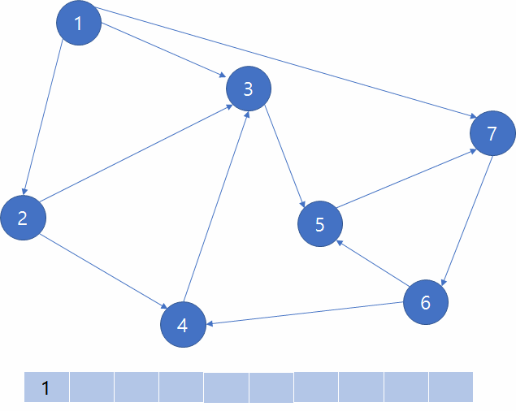

# [Graph Data Structure And Algorithms](https://www.geeksforgeeks.org/graph-data-structure-and-algorithms/#introDFSnBFS)

A Graph is a **non-linear data structure** consisting of **nodes** and **edges**. The nodes are sometimes also referred to as vertices and the edges are lines or arcs that connect any two nodes in the graph. More formally a Graph can be defined as,
>A Graph consists of a finite set of vertices(or nodes) and set of Edges which connect a pair of nodes.

## Topics

* **Introduction, DFS and BFS**
* Graph Cycle
* **Topological Sorting**
* **Minimum Spanning Tree**
* BackTracking
* Shortest Paths
* Connectivity
* Maximum Flow
* STL Implementation of Algorithms
* Hard Problems
* Misc
* Quick Links

### 1. Graph and its representations

Following is an example of an undirected graph with 5 vertices.

Following two are the most commonly used representations of a graph.
1. Adjacency **Matrix**

2. Adjacency **List**

### 2. DFS (Depth-First Search, 깊이 우선 탐색)

깊이 우선 탐색은 그래프의 모든 정점들을 특정한 순서에 따라 방문하는 알고리즘 중 하나입니다. 현재 정점과 인접한 간선들을 검사하다가 방문하지 않은 정점을 발견하면 그 간선을 통해 방문하지 은 정점으로 이동하는 것입니다.
이 과정을 반복하다가 더 이상 방문할 수 있는 정점이 없으면 마지막으로 통과한 간선을 통해 뒤로 돌아가서 해당 정점에서 방문할 수 있는 정점을 탐색합니다. 이러한 과정을 반복하여 그래프의 모든 정점을 방문하는 알고리즘이 DFS 알고리즘입니다.

### 3. BFS (Breadth-First Search, 너비 우선 탐색)
너비 우선 탐색은 그래프의 모든 정점들을 특정한 순서에 따라 방문하는 알고리즘 중 하나입니다. 현재 정점과 인접한 간선들을 검사하다가 방문하지 않은 정점들을 발견하면 그 간선을 통해 방문하지 않은 정점들을 자료구조 큐에 넣습니다. 그리고 큐의 front 정점을 방문하고 pop합니다.
또 해당 정점에서 인접한 간선을 검사해 방문하지 않은 정점들을 큐에 넣고 방문하기는 과정을 반복하다가 더 이상 방문할 수 있는 정점이 없으면 종료합니다. 이러한 과정을 반복하여 큐에 더 이상 정점이 존재하지 않을 때까지 실행하여 그래프의 모든 정점을 방문하는 알고리즘이 BFS 알고리즘입니다

### 4. Applications of Depth First Search

1. For an unweighted graph, DFS traversal of the graph produces the minimum spanning tree and all pair shortest path tree.
2. Detecting cycle in a graph
> For every visited vertex 'v', if there is an adjacent 'u' such that u is already visited and u is not parent of v, then there is a cycle in graph.
3. [Strongly Connected componet](https://blog.naver.com/pkjhj485/221344212130)
3. [Path Finding](https://medium.com/omarelgabrys-blog/path-finding-algorithms-f65a8902eb40)
4. **Topological Sorting**
5. [To test if a graph is bipartite](https://gmlwjd9405.github.io/2018/08/23/algorithm-bipartite-graph.html)

### 5. [Applications of Breadth First Traversal](https://www.youtube.com/watch?time_continue=4&v=-CzEI2r5OTs)

1. Shortest Path in a graph
2. Web Crawler
3. Social Network
4. Cycle Detection
5. To test if a graph is bipartite
6. Broadcasting in a network
7. Ford-Fulkerson algorithm

