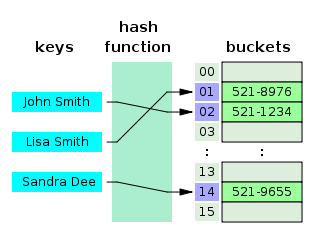

# [Hashing (해싱)](https://www.codeground.org/common/popCodegroundNote#)

임의의 길이의 데이터(키, Key)를 고정된 길이의 데이터(해시값, Hash value)로 변환한 뒤\
작은 크기의 해시 테이블로 대응(Mapping)시켜 식별하는 기법

해시 테이블은 M개의 버킷으로 이루어져 있으며\
이 글에서 다루는 해시값은 해당 키가 저장될 버킷의 번호(해시 테이블의 인덱스)를 나타냅니다.

키에서 해시값을 추출하는 과정:해시 함수(Hash function)\
해시 함수는 같은 키에 대해서는 동일한 해시값을, 다른 키에 대해서는 다른 해시값을 추출해야 합니다.\

하지만 일반적으로 해싱에서 해시값의 범위(M)는 키의 범위보다 작음\
--> 어떤 이상적인 해시 함수라도 `비둘기집의 원리`에 의해 서로 다른 두 키가 같은 해시값을 가질 수 있습니다. 
*  이런 경우를 충돌(Collision)이라고 합니다.



해싱이 사용되는 예)\
문자열(Key)을 정숫값(Hash value)으로 치환하는 방법\
이에 사용되는 가장 대표적인 해시 함수: n진법 \
"SCPC"이라는 단어가 있다고 하면, 아래와 같이 진법을 이용한 해시 함수를 만들 수 있습니다.

```
f(key) = ((((key[0]) * 26 + key[1]) * 26 + key[2])) * 26 … key[l – 1])
f("SCPC") = 19 * 26^3 + 3 * 26^2 + 16 * 26^1 + 3 * 26^0 = 336391
```
해시 함수의 시간 복잡도를 O(H)라고 할 때:\
**해시값의 중복이 없는 이상적인 해싱**에서 키의 `검색`, `삽입`, `삭제`에는 모두 O(H)의 시간이 걸립니다.

하지만 앞서 말했듯 해시값의 범위가 키의 범위보다 작을 때에는 충돌이 발생할 수 밖에 없습니다.

예를 들어 위와 같은 진법 변환을 해시 함수로 사용할 때에는 __문자열이 길어지면 해시값이 너무 커지므로 적당히 큰 수로 나머지 연산__한 값\
-> 이 글에서는 M(해시 테이블의 크기)으로 나머지 연산한 값을 해시값으로 쓸 수 있습니다.

이때 해시값의 M에 대한 나머지가 같은 키끼리는 충돌이 발생합니다.


충돌을 제어하는 방법도 다양합니다.\ 
대표적인 충돌 제어 방법 중 하나: **체이닝(Chaining)** 
체이닝은 충돌한 키들을 보존하기 위해 각 버킷을 리스트 형태로 구현합니다. 최초의 버킷은 모두 원소가 0개인 리스트의 헤더이며, 해당 버킷에 데이터가 추가될 때마다 노드를 추가합니다. 
이때 어떤 키가 해시 테이블에 존재하는지 검사하기 위해서는 해당 키의 해시값에 해당하는 버킷이 가진 노드를 모두 순회해야 합니다. 
이는 리스트에서 원소를 찾는 연산과 동일하며 이에 기반한 삭제 연산도 같은 선형 시간이 걸립니다. 
이때 몇 개의 버킷에만 데이터가 편중되는 최악의 경우 각 연산의 시간 복잡도는 O(H + N)이 됩니다.

이런 상황을 최소한으로 하기 위해서는 해시값의 추출 과정, 즉 해시 함수를 어떻게 구성할 것인지가 핵심이 됩니다.
좋은 해시 함수란 해시값을 추출하는 연산이 빠르되 충돌이 적고 해시 테이블의 영역을 고르게 사용할 수 있어야 합니다.
예를 들어 위에서 다룬 A * pow(B) mod M 형태의 진법 변환을 사용할 때 A의 값을 0이 아닌 1부터 시작하는 것이 좋습니다.
0을 사용하게 되면 "A"와 "AAA"의 해시값이 같아지기 때문입니다. 또한 B와 M이 서로소인 것이 충돌 확률이 낮아 더 좋은 해시 함수가 될 수 있습니다.

해시 함수의 구현과 충돌 제어 방법, 좋은 해시 함수의 조건에 관해서는 굉장히 많은 자료가 있으므로 보다 깊은 이해를 위해 직접 찾아보시기 바랍니다.

글의 첫 부분에서 말했듯 해싱의 핵심은 값의 식별입니다. 그렇기에 원소의 중복을 허용하지 않는 Set이나 Key:Value쌍에서 중복된 Key가 존재하면 안 되는 Map과 같은 자료구조를 구현하는 데에 사용되기도 합니다.
