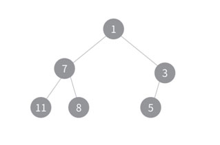
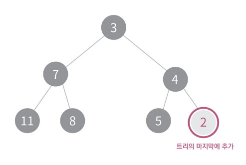
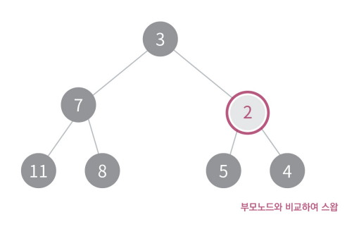
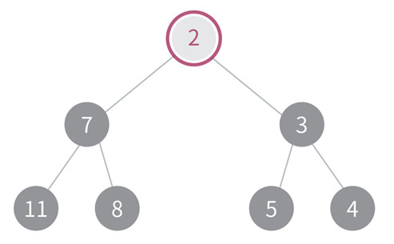
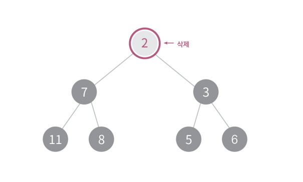
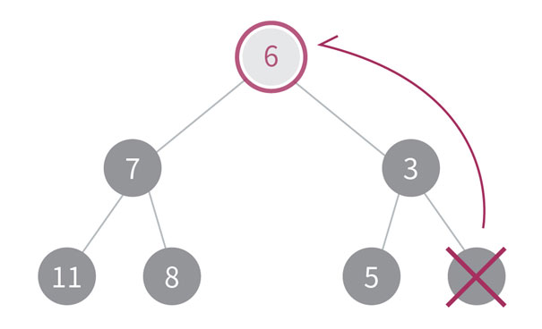
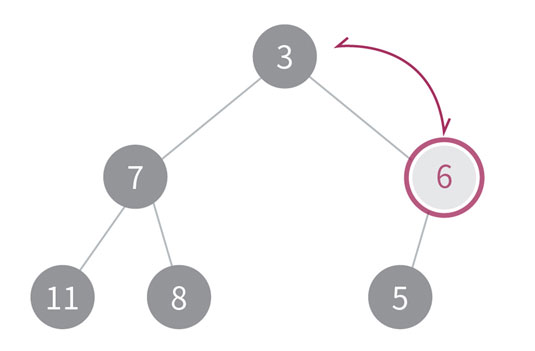
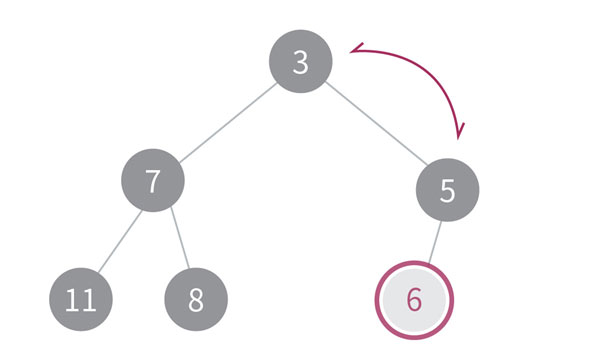

# Heap (힙)

힙(heap) 은 최댓값 또는 최솟값을 빠르게 찾아낼 수 있는 트리형 자료구조입니다.

힙은 완전이진트리 형식을 따르며 모든 부모 노드의 값이 자식 노드들의 값과 일정한 대소 관계를 가지게 되는 규칙을 가지고 있습니다.

또한 자식노드 사이의 상관관계는 없으므로 유의하여야 합니다.

부모 노드의 값이 자식 노드의 값보다 크다면 최대 힙(Max Heap), 부모 노드의 값이 자식 노드의 값보다 작다면 최소 힙(Min Heap) 으로 부릅니다.

힙의 규칙에 따라 트리의 가장 상단에는 최댓값 또는 최솟값이 있는 것이 자명하기 때문에, O(1) 만에 최댓값과 최솟값을 찾을 수 있습니다.

**<최소 힙의 예>**

힙의 삽입은 트리의 가장 마지막 부분에 데이터를 삽입한 후, 부모 노드와 삽입 부분 노드의 대소 관계를 확인하여 힙의 규칙에 맞도록 부모 노드를 탐색, 스왑하는 과정으로 이루어져 있습니다.

**트리의 마지막에 추가**

**부모노드와 비교하여 스왑**

**힙의 조건을 만족함**

힙의 삭제는 삭제할 원소를 삭제 한 후 트리의 가장 마지막 원소를 삭제된 원소의 위치에 넣어준 후 힙의 조건을 만족하는 적절한 위치에 이를 수 있도록 조정해주면 됩니다.

**제일 마지막 원소를 삭제된 원소의 자리로 옮긴다**

**힙의 규칙에 맞도록 부모와 자식노드를 바꾸어 준다**

**삭제가 완료된 힙**

힙의 삽입과 삭제의 시간 복잡도는 최악의 경우 최하단 노드로부터 최상단 노드까지 스왑이 필요하게 됩니다. 따라서 O(log N)의 시간 복잡도를 가집니다.

완전이진트리를 사용하기 때문에 최대 사이즈의 배열로 선언 후 쉽게 구현하실 수 있습니다.

C++ Standard Library에 Priority Queue를 제공하기 때문에, 사용할 연산자를 정의한 후 힙과 유사하게 사용하실 수 있습니다.

