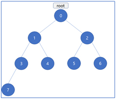

# Tree(트리)

트리는 자식과 부모의 관계로 이루어진 계층적인 구조입니다. 필요에 따라 다양한 종류로 나뉘게 되는데 이번 문서에서는 제일 간단한 트리인 이진 트리에 대해서 설명하려고 합니다. 먼저 이진 트리에서 사용하는 용어들을 정리해보면 다음과 같습니다.

```
Root : 트리에서 가장 최상위에 존재하는 노드

Child : 어떠한 노드의 자식 노드

Parent : 어떠한 노드의 부모 노드

Siblings : 같은 부모를 갖는 형제 노드

Leaf/Terminal : 자식 노드를 갖지 않는 노드

Branch/Internal : 자식 노드를 적어도 1개 이상 갖는 노드

Degree : 노드가 가지고 있는 자식 노드의 개수

Height : 해당 노드부터 Leaf 노드까지의 가장 긴 거리

Level : 트리 각 층의 단계 (루트 노드의 경우 1)
```
위에서 트리에서 사용하는 용어들을 알아보았습니다. 여러분의 이해를 돕기 위해 아래의 그림을 통해서 용어들을 설명하도록 하겠습니다.


1번 노드를 self 현재 노드라고 한다면, 0은 1번 노드의 Parent입니다.( 0은 트리의 최상단에 위치하기 때문에 root 노드입니다). 그리고 3번과 4번 노드는 1의 자식 노드들 입니다. 2번 노드는 1번 노드의 부모인 0번 노드의 자식 노드이므로 sibling입니다.(자매 노드). 또한 자식이 하나도 존재하지 않으면 Leaf/Terminal 노드입니다. 이러한 노드들은 그림에서 연두색으로 표시하였습니다. 만약 자식이 1명이라도 존재한다면 Branch/ Internal 노드입니다. 이러한 노드들은 그림에서 파랑색으로 표현했습니다. 1번 노드의 Degree는 자식 노드의 수인 2입니다. Height는 1번 노드보다 하위 노드들 중 가장 아래에 있는 노드 7번 노드와의 거리인 2입니다. 1번 노드의 level은 2입니다.(루트 노드는 Level이 1)

이제 위에서 정리했던 용어들의 설명이 다 끝났습니다.

다음으로 트리의 탐색 방법에 대해서 설명을 하도록 하겠습니다. 트리 노드들의 값들을 확인하기 위해선 어떤 방법을 사용할까요? 만약 트리가 선형구조로 되어 있다면 그냥 포인터를 하나 두고 한 칸 씩 뒤로 옮기면서 확인하면 되었겠지만 아쉽게도 트리는 비선형 구조입니다. 따라서 일반적인 선형탐색 방법으로는 모든 노드들을 확인할 수 없습니다. 트리에서는 이러한 탐색과정을 Traversal(순회)이라고 합니다. 순회의 방법에는 여러가지가 있지만 대표적으로 사용하는 방법은 3가지가 있습니다. 그 방법은 Pre-Order traversal(전위 순회), In-Order traversal(중위 순회), Post-Order traversal(후위 순회) 입니다. 이 3가지 순회의 차이점은 방문 시 수행할 기능을 어느 시점에 호출하는가 입니다.

먼저 Pre-Order의 수행 방법입니다. (방문 시 수행할 기능은 값 출력이라고 하겠습니다.)

```cpp
Pre-Order(현재 트리 노드의 위치 cur){
  
  Print(cur’s value)
  
  If(cur’s left exist){
	Pre-Order(cur->left)
  }
  If(cur’s right exist){
	Pre-Order(cur->right)
  }
}
```

두 번째로 In-Order의 수행 방법입니다.
```cpp
In-Order(현재 트리 노드의 위치 cur){
  If(cur’s left exist){
	In-Order(cur->left)
  }
  
  Print(cur’s value)
  
  If(cur’s right exist){
	In-Order(cur->right)
  }
}
```

마지막으로 Post-Order의 수행 방법입니다.
```cpp
Post-Order(현재 트리 노드의 위치 cur){
  If(cur’s left exist){
	Post-Order(cur->left)
  }
  If(cur’s right exist){
	Post-Order(cur->right)
  }
  
  Print(cur’s value)
```

위의 3가지 트리 순회를 보면 Print, 즉 노드를 방문했을 때 수행할 기능의 순서만 변화하는 것을 알 수 있습니다. 그러면 위에서 사용했던 예시인 <그림 1>을 이용하겠습니다.



먼저, Pre-Order(0 : root)을 실행했을 때 출력 결과에 대해서 말씀드리겠습니다. Pre-Order는 자기 자신-왼쪽-오른쪽 순서로 작업을 수행하는 방식입니다.
```
(1) 루트인 0번 노드에서 출발하므로 0을 출력합니다. 그리고 왼쪽 노드가 존재하므로 Pre-Order(1)을 호출합니다.

(2) 1번 노드에서 1을 출력하고 마찬가지로 왼쪽 노드가 존재하므로 Pre-Order(3)을 호출합니다.

(3) 3번 노드에서 3을 출력하고, 왼쪽 노드가 존재하므로 Pre-Order(7)을 호출합니다.

(4) 7번 노드에서 7을 출력하게 됩니다. 7번 노드는 왼쪽 노드가 없습니다. 따라서 오른쪽 노드를 확인합니다. 하지만 오른쪽 노드 역시 존재하지 않으므로 Pre-Order(7)은 종료됩니다.

(5) 다시 Pre-Order(3)으로 돌아갑니다.(재귀 함수) 방금 Pre-Order(3)에서 왼쪽 노드를 확인했기 때문에 오른쪽 노드를 확인합니다. 하지만 오른쪽 노드가 존재하지 않으므로 Pre-Order(3) 역시 종료됩니다.

(6) Pre-Order(1)로 돌아가게 됩니다. 마찬가지로 왼쪽 노드를 확인했으므로 오른쪽 노드를 확인하는데 4번 노드가 오른쪽 노드이므로, Pre-Order(4)를 호출합니다.

(7) 4번 노드에서 4가 출력됩니다. 4번 노드도 7번과 같이 Leaf/Terminal 노드이므로 그냥 종료됩니다.

(8) Pre-Order(1)로 돌아가고 Pre-Order(1)도 종료되어 Pre-Order(0) 으로 돌아갑니다. 이러한 방식으로 방문하게 되면 출력결과는 0-1-3-7-4-2-5-6으로 출력하게 됩니다.
```

이번에는 In-Order를 실행했을 때 출력 결과에 대해서 말씀드리겠습니다. In-Order는 왼쪽-자기 자신-오른쪽 순서로 작업을 수행하는 방식입니다.
```
(1) 우선 루트인 0번 노드에서 출발합니다. 하지만 Pre-Order와는 다르게 이때 0을 출력하지 않고 왼쪽 자식 노드의 유무를 확인합니다. 이때 왼쪽 노드가 존재하므로 In-Order(1)을 호출합니다.

(2) 1번 노드에서도 1을 바로 출력하지 않고, 왼쪽 노드가 존재하므로 In-Order(3)을 호출합니다.

(3) 3번 노드에서도 3에서도 3을 바로 출력하지 않고, 왼쪽 노드가 존재하므로 In-Order(7)을 호출하게 됩니다.

(4) 7번 노드는 Leaf/Terminal 노드이므로 왼쪽 노드가 없어 7을 출력하고 오른쪽 노드의 유무를 하지만 오른쪽 노드도 없으므로 종료됩니다.

(5) 다시 In-Order(3)으로 돌아가서 3을 출력하고 오른쪽 노드를 확인하지만 존재하지 않으므로 종료됩니다.

(6) 다시 In-Order(1)로 돌아가서 1을 출력하고 오른쪽 노드로 4가 존재하므로 In-Order(4)를 호출합니다.

(7) 4번 노드 역시 Leaf/Terminal 노드이므로 4를 출력하고 종료됩니다.

(8) 다시 In-Order(1)로 돌아가서 종료되고, In-Order(0)으로 돌아가서 0을 출력합니다.

이러한 방식으로 방문하게 되면 출력값은 7-3-1-4-0-5-2-6이 됩니다. 이것은 x좌표 순으로 정렬했을 때의 순서와 동일합니다. 따라서 자신보다 작은 값은 왼쪽 서브 트리, 큰 값은 오른쪽 서브 트리에 저장하는 이진 탐색 트리라면 In-Order Traversal 방식을 이용했을 때 정렬된 값이 나오게 됩니다.
```

마지막으로 Post-Order를 설명하겠습니다. 이 방식은 왼쪽-오른쪽-자기자신 순서로 수행하는 방식입니다.
```
(1) 우선 루트인 0번 노드에서 시작하고, 왼쪽 노드가 존재하므로 Post-Order(1)을 호출합니다.

(2) 1번 노드에서도 왼쪽 노드가 존재하므로 Post-Order(3)을 호출합니다.

(3) 3번 노드 역시 왼쪽 노드가 존재하므로 Post-Order(7)을 호출합니다.

(4) 7번 노드는 Leaf/Terminal 노드이므로 7을 출력하고 종료됩니다.

(4) 다시 Post-Order(3)으로 돌아가서 3번 노드는 오른쪽 노드가 없으므로 3을 출력하고 종료됩니다.

(5) 1번 노드는 오른쪽 노드가 존재하므로 Post-Order(1)로 돌아가서 오른쪽 노드인 Post-Order(4)을 호출합니다.

(4) 4번 노드는 Leaf/Terminal 노드이므로 4를 출력하고 종료됩니다.

(5) 다시 Post-Order(1)로 돌아가서 1을 출력하고 종료됩니다.

이와 같은 방식으로 방문하면 출력값은 7-3-4-1-5-6-2-0이 됩니다.
```

이러한 트리의 순회 방법들로 트리에서 원하는 값을 탐색할 수 있습니다. 그러면 다음으로는 트리의 삽입에 대해서 알아보도록 하겠습니다.

이진 트리로 설명을 하자면, 각 노드의 왼쪽 오른쪽 노드를 저장하기 위해 아래와 같은 2차원 배열을 만들어줍니다.

`Child[Node_Num][LR]` : Node_Num은 해당 노드의 번호, LR은 0일 경우 왼쪽 자식 노드 1일 경우 오른쪽 자식 노드를 의미합니다. 따라서 0번 노드의 왼쪽 노드가 1번 노드라는 것을 표현하고 싶다면 Child[0][0] = 1과 같이 쓰면 되고, 0번 노드의 오른쪽 노드가 3번 노드라는 것을 표현하고 싶다면 Child[0][1] = 3과 같이 쓰면 됩니다.

그리고 만약 트리 노드마다 값이 존재한다면 1차원 배열인 Value를 만들어주어 각 노드의 값을 표현해주면 됩니다.
